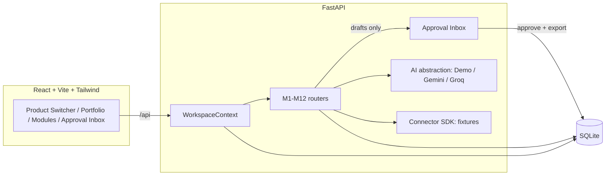

# MAGNET

**One autonomous growth engine for all your products.**

MAGNET is an open-source, multi-product marketing automation and growth
platform. Add a product once and MAGNET builds an ICP, finds leads, watches
competitors and reviews, generates SEO pages and content, drafts outreach and
lifecycle campaigns, tracks referrals, and rolls it all up into a funnel/ROI
dashboard -- per product, and compared across your whole portfolio.

## The problem

Growth work for a single product is already a lot of disconnected tooling.
Run several products and it multiplies: separate spreadsheets, separate
outreach lists, separate SEO backlogs, no shared view of what's actually
working. Most of that work is also mechanical -- reading community posts for
buying signals, drafting the fiftieth outreach variant, noticing a competitor
had an outage -- work an agent can do a first pass on, as long as a human
still decides what actually goes out the door.

## The solution

MAGNET treats every product as a **workspace**. Onboard a product (paste a
description or point at its landing page) and MAGNET derives a
`ProductProfile` and `ICP` that every other module reads from -- so two
different products produce genuinely different leads, keywords, content, and
pages, not the same dashboard with a different logo.

Every module that would take an outward action (reply to a post, send an
email, publish a page) instead writes a **draft** to the **Approval Inbox**.
Nothing leaves MAGNET without a human clicking Approve.

## Key capabilities

| Module | What it does |
|---|---|
| M1 ICP Builder | Derives an ideal customer profile from the product profile |
| M2 Lead Radar | Scores community posts (Reddit/HN/forums/PH fixtures) for buying intent, drafts a helpful reply for high-opportunity ones |
| M3 Competitor Watch | Flags competitor outages/price hikes/shutdowns, drafts switch-opportunity outreach |
| M4 pSEO Factory | Generates 100+ unique, product-specific landing pages |
| M5 Reputation | Drafts responses to negative reviews |
| M6 Free Tool | A real, working ICP-fit calculator that captures attributed leads |
| M7 Content Studio | Generates X/LinkedIn/newsletter/video-script variants, A/B copy, case studies, with deterministic hook/virality scores |
| M8 Outreach | Drafts a 3-step personalized outreach sequence per lead |
| M9 Lifecycle | Finds stalled signups, drafts activation/rescue emails |
| M10 Voice of Customer | Clusters pain points into a Requested/Planned/In Progress/Shipped roadmap |
| M11 Referrals | Referral links, position tracking, tiered rewards, attributed signups |
| M12 Growth Analytics | Per-workspace funnel, conversion rates, ROI by module |
| Portfolio | Compares funnel/ROI across every product side by side |
| Approval Inbox | The single gate every outward action passes through, with a full audit trail |

## 90-second quickstart

Zero API keys required -- MAGNET runs entirely on seeded fixtures and a
deterministic local AI provider by default.

```bash
git clone <this-repo>
cd magnet
docker-compose up
```

Then open http://localhost:8080. Or without Docker:

```bash
cd magnet
./run.sh
```

Backend: http://localhost:8000/api/health -- Frontend: http://localhost:5173

Three demo products are seeded automatically on first boot (see
[docs/DEMO_DATA.md](docs/DEMO_DATA.md)): a team scheduling SaaS, a developer
shipping API, and a D2C fitness app. Switch between them with the product
switcher in the sidebar, or start from the Portfolio view.

## Architecture



See [docs/ARCHITECTURE.md](docs/ARCHITECTURE.md) for the full write-up:
workspace isolation, the connector SDK, the AI abstraction, the approval
state machine, and the attribution/analytics engine.

## Multi-product, by design

`workspace_id` is on every table that holds product-scoped data. All access
goes through `WorkspaceContext` (`backend/app/workspace_ctx.py`), which
pre-filters every query and stamps every write -- a router simply cannot
forget to scope a query, because there's no unscoped path to the DB.
Isolation is proven with automated tests, not just hidden in the UI (see
`backend/tests/test_isolation.py`).

## Add Product

Two paths, both produce the same `ProductProfile` + `ICP`:

- **Manual / Demo** (`/add`, "Manual / Demo"): paste a description or
  `product.yaml`-style text. No network calls, no API keys.
- **From URL**: give a public landing page URL. MAGNET checks `robots.txt`,
  fetches the page with an honest User-Agent, strips it to text, and derives
  the same profile fields.

## Demo mode vs. live mode

Demo mode (default) uses `DemoProvider`: deterministic, seeded text
generation, no network calls. Set `GEMINI_API_KEY` or `GROQ_API_KEY` to
switch to a live LLM for drafting -- the UI is identical except for the
`DEMO`/`LIVE` badge in the sidebar. A missing key never blocks startup.

## Ethics & safety model

- **Draft-first, always.** See M1-M12 above: every module that could act
  externally instead creates an `ApprovalItem` (`PENDING_APPROVAL`). Only
  `Approve` -> `Send/Export` moves it to `SENT`/`EXPORTED`, and only after
  that does a `GrowthEvent`/`AuditLog` record it. This is enforced in
  `backend/app/routers/approvals.py`, not just in the UI.
- **Ethical sourcing.** All connectors are demo fixtures in this build (see
  Known Limitations). The URL onboarding fetcher checks `robots.txt`, uses an
  honest identifying User-Agent, and only reads public pages -- no
  authentication bypass, no paywall bypass.
- **No manufactured engagement.** Nothing here posts, replies, or reviews on
  MAGNET's own initiative. Reviews/testimonials in the demo fixtures are
  synthetic and clearly fixture data, never presented as real.

## Known limitations

MAGNET follows the spec's own Tier Rules: Tier 1 (multi-tenant core,
onboarding, ICP, Lead Radar, Content Studio, Analytics, Approval Inbox,
Portfolio, 3 seeded products, tests) is fully built and tested. Tier 2/3
modules are real, working, and approval-gated, but intentionally simplified:

- **Live connectors** (Reddit/HN/Product Hunt/forums) are not implemented --
  only `DemoFixtureSource`-equivalent seeded data. The Connector SDK is
  structured so a live source is a drop-in addition (see ARCHITECTURE.md),
  but none ships in this build to avoid taking on ToS/rate-limit risk in a
  demo.
- **pSEO pages** are generated from template + dataset combinatorics
  (industry x use-case x audience), not crawled/scraped content -- each page
  has unique, product-specific copy but the generation logic is a heuristic,
  not an LLM pass.
- **Voice of Customer** clusters pain points from the seeded product profile
  directly rather than running real NLP clustering over free-text reviews.
- **Virality/hook scoring** is a deterministic heuristic (length, punctuation,
  novelty hash), not a trained model.
- **"Send/Export"** in the Approval Inbox simulates the external action and
  logs it to the audit trail; it does not call a real email/social API.

None of the above breaks the safety model -- every one of them still routes
through the Approval Inbox.

## Testing

```bash
cd backend && pytest tests -q       # 21 tests: isolation, approval-safety, onboarding, e2e, growth-logic
cd backend && ruff check app tests
cd web && npm run lint && npm run build
```

## Deployment

`docker-compose up` builds and runs both services (`backend` on 8000,
`web` on 8080, proxying `/api` to the backend via nginx). Persistent SQLite
data lives in the `magnet_data` volume.

## Roadmap

- Real connector implementations behind the existing Connector SDK interface
- Swap the heuristic pSEO/VOC generators for LLM-assisted passes in live mode
- Multi-user roles/permissions on top of the existing workspace model
